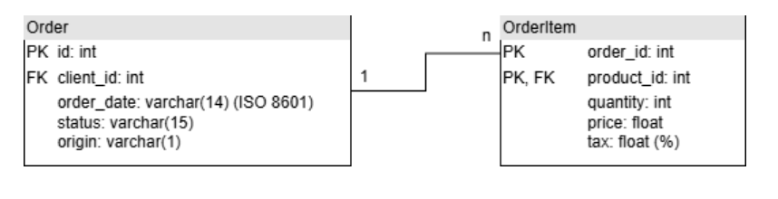

# ETL Project Report in OCaml - Pedro Pertusi

## 1. Introduction

This project aims to implement an ETL (Extract, Transform, Load) system using OCaml and functional programming principles. The primary objective is to process data from CSV files by reading, transforming (using higher-order functions such as map, filter, and reduce), and finally loading the results into a SQLite database. The project is organized using the dune build system, which also separates pure functions from impure ones.

#### Project Entity-Relationship Model

## 2. Project Objectives

- **Extraction:**  
  - Read data from CSV files available via HTTP and convert it into a list of records.
  - Utilize helper functions to correctly map CSV fields to the appropriate data types.
  - Isolate impure functions (file reading) from the pure functional logic.

- **Transformation:**  
  - Perform an inner join between two tables (Order and OrderItem) to consolidate order data.
  - Apply functional programming operations (map, filter, reduce) to calculate:
    - **Total Amount:** The sum of revenues for each order (calculated as price × quantity).
    - **Total Taxes:** The sum of taxes (computed as the tax percentage applied to the revenue of each item).
  - Implement functions to group records by month and year to compute average revenue and taxes.

- **Load:**  
  - Persist the transformed data into a SQLite database.
  - Generate an output CSV file containing the fields order_id, total_amount, and total_taxes for managerial dashboards.
  
- **Additional Outputs:**  
  - Create an additional output that aggregates average revenue and taxes by month and year.

- **Code Quality and Documentation:**  
  - Clearly separate pure functions from impure ones.
  - Document all functions using docstrings.
  - Develop comprehensive unit tests for the pure functions to ensure correctness and reliability.

## 3. Project Structure

The project is organized into several files, each with its own specific responsibility. Below is an overview of the files along with their contents and the nature of their functions:

- **filter.ml**  
  - **Description:** Contains functions to filter joined order-item records based on status and origin.  
  - **Key Function:** `filter_joined_records`  
  - **Purity:** Pure – it processes lists without side effects.

- **helper.ml**  
  - **Description:** Provides helper functions for user input, date manipulation, and list grouping.  
  - **Key Functions:**  
    - `prompt`: Reads user input from the command line (impure).  
    - `extract_month_year`, `split_date`, `list_group_by`: Handle string manipulation and list grouping (pure).  
  - **Purity:** Mixed – includes both pure functions (for data manipulation) and an impure function (`prompt`) for I/O.

- **parser.ml**  
  - **Description:** Parses CSV data into structured records for orders and order items.  
  - **Key Functions:**  
    - `parse_order_row`, `parse_order_item_row`: Convert CSV row data into records.  
    - `csv_skip_header_map`, `orders_of_csv`, `order_items_of_csv`: Process CSV data while skipping header rows.  
  - **Purity:** Pure – these functions perform data transformation without side effects.

- **reader.ml**  
  - **Description:** Handles data retrieval from a URL.  
  - **Key Functions:**  
    - `fetch`: Retrieves data via an HTTP GET request (impure).  
    - `read_csv_url`: Fetches and parses CSV data from a URL (impure).  
  - **Purity:** Impure – involves network operations and I/O.

- **records.ml**  
  - **Description:** Defines the data structures (records) used across the project, including orders, order items, joined records, and summaries.  
  - **Key Components:** Type definitions for `order`, `order_item`, `order_join_items`, `order_summary`, and `order_mean_summary`.  
  - **Purity:** Pure – contains only type definitions.

- **transformer.ml**  
  - **Description:** Contains functions for data transformation and aggregation.  
  - **Key Functions:**  
    - `inner_join_orders`: Merges orders and order items via an inner join.  
    - `aggregate_order_items`: Aggregates data to compute totals for orders.  
    - `mean_order_items`: Calculates mean values for grouped orders.  
  - **Purity:** Pure – focuses solely on processing and aggregating data without side effects.

- **writer.ml**  
  - **Description:** Manages writing data to a SQLite database and generating CSV files.  
  - **Key Functions:**  
    - `create_table`, `insert_record_generic`, `save_records_generic`, `write_records_generic`: Handle database operations.  
    - `save_order_summaries`, `save_monthly_summaries`: Save aggregated order data into SQLite tables.  
    - `save_order_summaries_csv`, `save_monthly_summaries_csv`: Write summaries to CSV files.  
  - **Purity:** Impure – involves file I/O and database interactions.

## 4. Optional Requirements Implemented

The project includes several optional features:
- **Read Data from a URL:**  
  - The system fetches CSV data from a specified URL (in this case, from its own GitHub repository).
- **SQLite Integration:**  
  - The transformed data is saved into a SQLite database.
- **Data Aggregation:**  
  - An inner join is performed between the Order and OrderItem tables to consolidate data before transformation.
- **Parameterized Filtering:**  
  - Allows selection of orders based on status (e.g., complete) and origin (e.g., online).
- **Project Organization with dune:**  
  - The project is structured using the dune build system, which helps manage dependencies and build processes.
- **Function Documentation:**  
  - All functions are documented with clear docstrings, explaining their purpose and usage.
- **Monthly/Yearly Aggregation:**  
  - Computes averages for revenue and taxes grouped by month and year.
- **Unit Testing for Pure Functions:**  
  - Covers critical scenarios for all pure functions.

## 5. Use of Generative AI

Generative AI was actively used during the development of the project code (using Copilot and ChatGPT). It assisted in generating code snippets, suggesting improvements, and refining the implementation. The contributions of AI were integrated into the codebase alongside manual development efforts, and all final decisions were made by the developer. In addition, ChatGPT was used to generate the README file and the project report.

## 6. Conclusion and Recommendations

This report outlines the complete process, from data extraction to transformation and loadingm, emphasizing clear modularity and adherence to functional programming paradigms. This roadmap serves as a comprehensive guide for reproducing and extending the ETL project in OCaml, ensuring that every step is documented and that the system remains robust, maintainable, and scalable.
